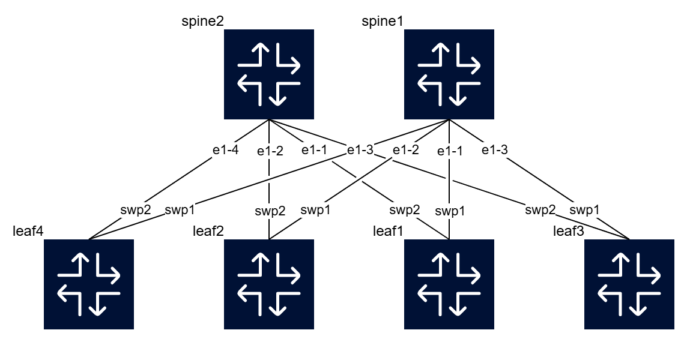

# Network Automation and Observability

This project provides a lab environment designed to demonstrate how modern automation principles can be applied in a multi-vendor network. It uses a container-based Leaf-Spine Data Center Fabric to showcase how to unify automation strategies across platforms with different capabilities, specifically Nokia SR Linux and NVIDIA Cumulus Linux.

For a detailed background on the project's motivation and the industry challenges it addresses, please see the introductory [blog post](http://adhocnode.com).

## Phased Rollout

The project will be developed and shared in phases.

The initial phase serves as a hands-on introduction to the distinct management interfaces of the two network operating systems in the lab. The goal is to build foundational skills by configuring the routers directly through their programmatic interfaces before moving on to more complex, abstracted automation.

Later phases will build upon this foundation to implement the unified automation framework, SoT integration, CI/CD pipelines, and advanced observability solutions.

## Getting Started: The Tutorial

This repository's first phase is a practical tutorial that explores the different automation philosophies of Nokia SR Linux (gNMI/YANG) and NVIDIA Cumulus Linux (NVUE REST API). You will learn to interact with the devices using command-line tools like `gnmic` and `curl`.

➡️ You can find the full [tutorial here](https://github.com/martimy/Network-Automation-and-Observability/blob/main/Tutorial%20-%20Network%20Automation%20with%20Nokia%20SR%20Linux%20and%20Cumulus%20Linux.md).

## Lab Environment Overview

The lab topology consists of six routers in a classic leaf-spine architecture, deployed using Containerlab.




- Two Spine Routers (`spine1`, `spine2`):
  - NOS: Nokia SR Linux (v25.3.3).
  - Management IPs: `192.168.121.101`, `192.168.121.102`.
  - Primary Interface: Modern, model-driven gNMI.
  - CLI access: ssh admin@<mgmt IP or host name>
  - Default username/password: admin/NokiaSrl1! 

- Four Leaf Routers (`leaf1` to `leaf4`):
  - NOS: NVIDIA Cumulus Linux (v5.3.0).
  - Management IPs: `192.168.121.111` to `192.168.121.114`.
  - Primary Interface: NVUE REST API.
  - CLI access: ssh admin@<mgmt IP or host bame>
  - Default username/password: root/root (or cumulus/cumulus)

The entire lab operates on the `192.168.121.0/24` management network. The Docker containers are pre-configured with all necessary prerequisites.

### How to Deploy the Lab

The environment is defined in the `topology.clab.yml` file. To start the lab, you will need to have Containerlab installed.

From the root of this repository, run the following command to deploy the topology:

```bash
sudo clab deploy [-t topology.clab.yml]
```

This command will start all six router containers and connect them to create the complete two-spine, four-leaf fabric. Once deployed, you can begin the tutorial by interacting with the devices.

To stop the lab, run the following command:


```bash
sudo containerlab destroy [-t topology.clab.yml] [--cleanup]
```
